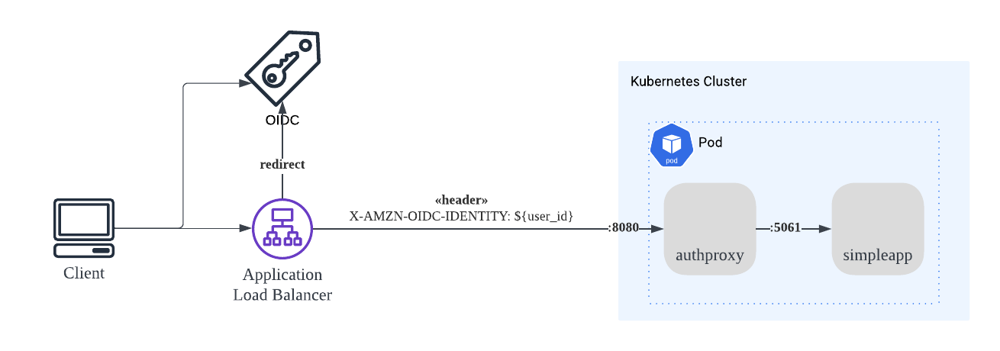

# AuthProxy

AuthProxy is a simple reverse proxy built for supporting server authorization from header. It will read the user identifier value from any header and grant the access if the user identifier is valid.

This reverse proxy is designed for encapsulating any application which does not have the capability for user authenticating. This reverse proxy does not provide the authentication feature. It requires an external authentication server such as ODIC.



The diagram above shows how it works. The authentication will be done by OIDC server and AWS ALB will pass the user ID to the AuthProxy on `X-AMZN-OIDC-IDENTITY` header

Reference https://docs.aws.amazon.com/elasticloadbalancing/latest/application/listener-authenticate-users.html

## Configuration

The setting can be done by environment variable. First, set the upstream server address on `TARGET_URL`

Set the environment variable in Kubernetes Manifest.

```
env:
  - name: TARGET_URL
    value: "http://localhost:5061"
```

The set the header to read user ID. The sample below will read the user ID from `X-AMZN-OIDC-IDENTITY` header and allow all users in the list to get access to the application server

Set the environment variable in Kubernetes Manifest.

```
env:
  - name: ACCEPTED_HEADERS
    value: |
      - name: X-AMZN-OIDC-IDENTITY
        values:
          - "113364102343434434343" # John
          - "432432432490890342343" # Doe
```

Additional, you can block specify path of request by adding `DENIED_PATHS` environment variable to the `AuthProxy`
The sample below will return HTTP status `403` when user ID `432432432490890342343` requests the `/api/debug` path.

Set the environment variable in Kubernetes Manifest.

```
env:
  - name: DENIED_PATHS
    value: |
      - name: BlockDebugApi
        headerValue:
          - "432432432490890342343" # Doe
        paths:
          - "/api/debug"
```
